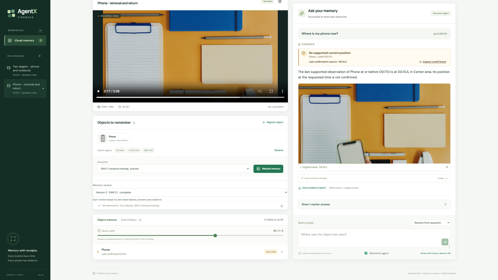
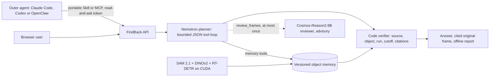

# AgentX FindBack

**Give your footage a memory.** Register an object once, then ask where it was at any moment of a recording or live capture. FindBack answers with the last location the footage supports, the observation time, and the original frame. When the evidence runs out, it says so instead of guessing.

## Submission

- **Demo video:** [FindBack demo on Bilibili](https://www.bilibili.com/video/BV19LaE6oEp6).
- **License:** Apache-2.0 (see [LICENSE](LICENSE))
- **中文项目说明 / Chinese project description:** [docs/PROJECT_DESCRIPTION.zh-CN.md](docs/PROJECT_DESCRIPTION.zh-CN.md)



_The deployed app on DGX Spark. The phone has been removed. At the 17.0 s cutoff, FindBack reports no supported current position and cites the last confirmed original frame, at 13.4 s. Footage: ["Flatlay of School Materials"](https://www.pexels.com/video/flatlay-of-school-materials-7744200/) by MART PRODUCTION ([Pexels License](https://www.pexels.com/license/)). This is licensed stock footage replayed as an uploaded recording, not team-filmed or live-camera footage._

## Why it matters

Workbenches, labs and stockrooms lose tools and assets in plain sight of a camera. Scrubbing hours of video to find them is slow. A plausible but wrong model answer is worse than no answer. FindBack keeps a versioned, timestamped memory of the objects a user registers. A question about the past can use only frames up to the chosen cutoff. Every published location links back to an original frame that can be replayed. A completed answer on a sealed recording can also be exported and verified offline. A recording shows where an object was in the footage; FindBack never claims where it is in the physical world now.

NVIDIA VSS covers broad video search, summarization and Q&A. FindBack's focus is narrower: the history of registered items, with historical cutoffs and checkable citations. This is a difference in scope, not a measured head-to-head result.

## Highlights

- **No wrong locations on real clips.** The deployed SAM 2.1 profile answered **11/11** held-out and **3/3** development location questions on licensed desk clips, with no wrong location. Across the planner regressions, no answer selected the wrong object.
- **A multi-agent system on one DGX Spark.** A Nemotron 3.5 Lightning NVFP4 planner, a Cosmos-Reason2-8B reviewer with a team-trained LoRA, and SAM 2.1/DINOv2/RT-DETR perception share the GB10's unified memory. Code verifies every published claim.
- **Measured model tuning, gated before promotion.** The team fine-tuned Cosmos-Reason2-8B with LoRA on the GB10, raising held-out point hits from **297/408 to 356/408**. A frozen gate still kept the adapter as an opt-in mode rather than a replacement for the base model. A CUDA mask stage runs **12.08×** faster with **831/831** identical predictions in each of three rounds.
- **Agent Skills that measurably help.** With the portable FindBack Skill, two coding agents answered **15/15** held-out prompts, up from **1/15** without it. Six versioned application Skills are hashed into the trace of each run, answer and review that loads them, and all eight Skill packages carry signatures that verify against the team's published key.
- **Live and verifiable.** In a single-client test, a warm 5 FPS live capture reached memory with a p95 of **0.818 s** (one target) and **1.016 s** (two targets), with no dropped frames. An answer from a completed memory of a sealed recording exports as an offline report, with its original frames and a standalone integrity verifier.

## Architecture and multi-agent collaboration



The pipeline chains five collaborating roles. Each has a narrow contract:

1. **Outer agent** (optional). A coding or chat agent uses the portable [`findback-video-memory` Skill](skills/README.md), the [MCP server](integrations/mcp/README.md) or [OpenClaw](integrations/openclaw/README.md) to ask a trusted FindBack server. An agent token grants read-and-ask access only.
2. **Planner agent.** Nemotron 3.5 Lightning answers one JSON step per turn over six tools: `find_objects`, `list_objects`, `get_state`, `get_history`, `get_observation` and a single-use `review_frames`. Unknown tools, repeated calls, invalid JSON or the step limit end the loop with a visible fallback to the deterministic resolver. Indirect descriptions ("the item that disappeared twice") are compiled into typed selection criteria. Code evaluates those criteria against every registered object.
3. **Reviewer agent.** Cosmos-Reason2-8B localizes the object frame by frame against its registration crop. Code orders the frames and names the regions. Reviews are saved separately and **cannot rewrite memory**. In one real review of the removal moment, a free-form Cosmos review described the phone as "undisturbed" while its own cited frame showed it gone. The memory answer (last seen at 13.4 s) was unaffected.
4. **Perception workers.** SAM 2.1 Small tracks from the registration box on CUDA. DINOv2 checks appearance. RT-DETR companion tracks quarantine look-alike collisions. Camera-pose recovery maps positions back to the registration view.
5. **Code verifier.** Before a location is published, code checks the recording hash, object, memory version, observation IDs and cutoff. The final text is rendered from saved observations, never from model prose.

Details: [architecture and memory contract](docs/ARCHITECTURE.md).

## Agent Skills design

Skills in FindBack are **scope and safety contracts**, not capability prompts. Code loads the applicable Skill at each step, records its SHA-256 in the run, answer or review, and publishes the exact bodies at `GET /api/v1/skills`.

| Step | Skills loaded | Deliberately not loaded |
| --- | --- | --- |
| Planner answering a direct question | `retrieve-object-history`, `verify-location-answer`, `answer-with-memory-tools` | `review-visual-evidence` (pixels never reach a published location) |
| Planner compiling an indirect description | `compile-object-selection` | Loaded only when needed: an explicit selection or an exact registered name skips it |
| Deterministic resolver | `retrieve-object-history`, `verify-location-answer` (provenance only) | `answer-with-memory-tools` (no tool loop runs) |
| Cosmos visual review | `review-visual-evidence` | — |
| Indexing | `observe-object-events` (implemented by the reducer) | — |

The two portable Skills let other agents use FindBack:

- `findback-video-memory` asks a trusted server and retrieves cited frames.
- `findback-evidence-audit` verifies an exported report offline, without executing its contents.

Every Skill package follows the NVIDIA Verified Skills layout: `SKILL.md`, Skill Card, positive and negative routing cases in `evals/evals.json`, `BENCHMARK.md`, and a detached OpenSSF model-signing signature. They are team-authored and **not NVIDIA-verified**. NVIDIA SkillSpector, Semgrep and Gitleaks scans were triaged.

**Measured effect:**
- **Portable Skill.** On three held-out prompt sets, Claude Code and Codex each went from **1/15 to 15/15** correct positives with the Skill (exact McNemar p = 0.000122 per agent). One of 30 negative runs activated it unnecessarily; that run still refused a live-location claim. No access token leaked in 200 runs. A smaller local model benefited less and over-activated.
- **Internal Skills.** Here the result is neutral. They reduced rejected selection plans from **36 to 25** across 168 cases, but held-out correctness was **25/28** with or without them. A later paired run scored **28/28** in both arms. The code validators, not the Skill text, are the safety backstop.

See the [application Skill contracts](src/agentx/skills/README.md) and [portable Skills](skills/README.md).

## Model deployment on DGX Spark

The production path runs entirely on one DGX Spark (GB10, CUDA 13.0, aarch64). Only the optional hosted StepFun API and any external coding agent run off the node. vLLM 0.28.0 serves the planner and the reviewer as separate loopback processes. The application runs as a single process with SAM 2.1, DINOv2 and RT-DETR loaded in-process.

| Service | Checkpoint | Served name and port | Context / max seqs | Key flags | GPU memory fraction | Weights; resident memory |
| --- | --- | --- | --- | --- | --- | --- |
| Planner | Nemotron 3.5 Lightning 30B-A3B NVFP4 (organizer-supplied ModelOpt mixed-precision checkpoint) | `nemotron`, 127.0.0.1:8000 | 32,768 / 8 | `--reasoning-parser nemotron_v3`, `--enable-auto-tool-choice --tool-call-parser qwen3_coder`, `--trust-remote-code` | 0.3 | 17.86 GiB; 37,002 MiB engine |
| Reviewer | Cosmos-Reason2-8B (ModelScope `nv-community/Cosmos-Reason2-8B`) plus LoRA `findback-grounding-v1` | `nvidia/Cosmos-Reason2-8B` and `findback-grounding-v1`, 127.0.0.1:8002 | 16,384 / 4 | `--dtype bfloat16`, `--limit-mm-per-prompt {"image":8}`, `--enable-lora --max-lora-rank 16` | 0.3 | 16.74 GiB; 34,623 MiB engine |
| Perception | SAM 2.1 Small, DINOv2-small, RT-DETR R18 (pinned revisions) | in the app process | — | bf16, session state on GPU | — | 1,374 MiB |

`bash scripts/spark/start_model_services.sh` starts the two engines one after the other and waits for each model name on `/v1/models`. Both fractions are shares of the unified memory and they add up. vLLM aborts if another engine allocates memory while it profiles, so starting them in sequence avoids that failure.

The evaluated perception profile is stricter than the generic defaults in `.env.example`:
- SAM 2.1 presence thresholds 0.95/0.995 and appearance threshold 0.85;
- DINOv2 identity on;
- the look-alike distractor guard on;
- 5 FPS sampling.

The planner runs with 800 output tokens and a 512-token selection thinking budget. Reference reviews use the integer 0–1000 point contract at 768 px, with 8 workers. The [deployment guide](docs/DEPLOYMENT.md#spark-competition-profile) lists the exact settings.

## Model optimization and tuning

Each change was compared on frozen inputs. A change was promoted only if it passed its gate. The rejected changes are part of the engineering record.

| Change | Measured effect | Decision |
| --- | --- | --- |
| Organizer-supplied NVFP4 planner checkpoint (a selection and serving choice, not team quantization) | 17.86 GiB weights leave room for the reviewer and perception to stay resident at 0.3 + 0.3 | Production |
| Reasoning parser for typed selection | vLLM rejects the 512-token selection thinking budget without `nemotron_v3`, which would force a fallback on every indirect description | Production |
| Per-frame grounded review instead of one 8-frame request | On a controlled fixture, the multi-frame answer named the wrong region; per-frame 8B localization was right in 8/8 frames (8.82 s) | Production (one fixture; ordering stays in code) |
| Integer 0–1000 points at 768 px for reference reviews | Bottle cohort 46 → 126/165 hits, with false-visible unchanged at 3/11; desk 131 → 142/201 | Production. Prompt, format and resolution changed together |
| 8 concurrent review workers instead of 4 | Median 6.731 → 4.158 s per 8-frame window (−38%), with 0 mismatches | Production |
| CUDA mask reductions: integer box and overlap math on GPU, compact results to CPU | 21.120 → 1.748 ms at 1080p (12.08×); 98.347 → 8.066 ms at 4K. Full indexing 83.848 → 81.529 s (−2.8%), with **831/831** predictions identical in each of 3 rounds | Production |
| SAM 2.1 session state kept on GPU (unified memory) | −10 to −16% per frame; every detection identical on six captures | Production |
| Size-jump quarantine added to the look-alike guard (mask area above 4× the recent median) | On a late-entry swap, wrong boxes 230/300 → 0/300; correct boxes 51 → 40 (the system abstains after the break) | Production. A safety trade-off |
| **LoRA fine-tuning of Cosmos-Reason2-8B on the GB10** | Recipe: PEFT rank 16, α 32, 43.6 M trainable parameters, vision tower frozen, 1 epoch, bf16 with gradient checkpointing, process capped at 55% of unified memory. v1 used 5,000 GOT-10k-derived reference-crop → point samples (4 h 33 min, 27.04 GiB peak). Held-out hits **297 → 356/408**, but false "visible" on development absent requests rose **5 → 9/18** | **Gate failed** as a base replacement. The gate was frozen before training: ≥5 pp held-out recall, precision not lower, no more absent-frame false claims |
| LoRA v2, rebalanced to 33.6% absent samples | 352/408; false visible 7/18 | Gate failed |
| Fusion: base decides presence, v1 supplies the point | Ten unused bottle sequences: **167 → 185/240** hits. Different-recording proxy claims **86 → 75/240** | **Gate passed.** Served as an opt-in reference-review mode |
| LoRA v3 with 900 look-alike hard negatives | Proxy claims fell (guitar 158 → 89, fan 138 → 24/168), but visible hits dropped on every cohort (desk 167 → 141) | Gate failed; a base-point + v3 veto rule also failed prospectively (75 vs 110 hits) |
| FP8 online quantization of the reviewer | Weights 16.74 → 10.04 GiB, but net −14 development points and false visible 5 → 7/18 | Rejected; reviewer stays bf16 |
| Step3-VL-10B with a no-think chat template | One grounding frame went from 110.7 s (1,525 tokens) to 3.3 s | Template adopted for the bake-off; model not promoted (below) |
| Cosmos3-Nano as reviewer | Held-out 352/408 vs 297/408 for the base, but false visible 8/18 vs 5/18 on development absent requests | Not promoted |
| SAM 2.1 Large instead of Small | Look-alike cup 27/225 vs 117/225 correct; indexing 95.4 vs 65.0 s | Rejected |
| Zoomed second-look review pass | About 1.8× inference; confirmation moved points by a median of 0.3% of the frame | Left off |

Training and serving render reviewer prompts through the same functions, and a test pins their hashes. Adapter reviews record `served_model`, so an adapter's output is never presented as the base model's.

## Technology stack

| Category | Component | Role | Evidence |
| --- | --- | --- | --- |
| NVIDIA platform and SDKs | DGX Spark GB10, CUDA 13.0, PyTorch 2.14 (cu130) | **Production.** One node hosts both model engines, perception and the app | Resident: 37,002 + 34,623 + 1,374 MiB |
| | vLLM 0.28.0 with FlashInfer kernels (organizer image) | **Production** serving for the planner, reviewer and LoRA | Both endpoints advertise their models on `/v1/models` |
| | NVIDIA ModelOpt NVFP4 checkpoint format | **Production** planner weights | 17.86 GiB for a 30B-A3B model |
| | Custom CUDA mask reductions (`src/agentx/vision/masks.py`) | **Production** tracking post-processing | 12.08× stage speedup |
| | NVIDIA SkillSpector 2.11.2 | **Used** for static Skill security scans | Findings triaged; internal Skills 0 |
| | NVIDIA Verified Skills package layout | **Adopted format** (not NVIDIA-verified) | 8 signed packages |
| | NVIDIA VSS Skills | **Evaluated** for routing beside FindBack | 21/22 correct first actions (StepFun 3.7 Flash) |
| NVIDIA models | Nemotron 3.5 Lightning 30B-A3B NVFP4 | **Production** planner and typed selection | 28/28 held-out vs 18/28 deterministic |
| | Cosmos-Reason2-8B | **Production** advisory reviewer, `cosmos` perception backend, registration suggestions | 270/366 development points |
| | Team LoRA `findback-grounding-v1` on Cosmos-Reason2-8B | **Optional**, served opt-in | 167 → 185/240 hits |
| | Cosmos3-Nano | **Evaluated** | 352/408 held-out; 8/18 false visible |
| | Cosmos-Reason2-2B | **Supported** for smaller hosts; not deployed | One-fixture comparison |
| StepFun models | StepFun 3.7 Flash (`step-3.7-flash`, hosted API) | **Optional** planner (`AGENTX_STEPFUN_*`) and **evaluated** outer Skill agent | Low reasoning effort: 28/28 and 11/11 with 0 fallbacks; routing 14/15 and 7/7; OpenClaw runs |
| | Step3-VL-10B | **Evaluated** reviewer, served locally with vLLM | 249/366 development points; no-think template 110.7 s → 3.3 s |
| Other open models and tools | SAM 2.1 Small, DINOv2-small, RT-DETR R18 + ByteTrack | **Production** tracking, identity and look-alike guard | 11/11 real-clip questions |
| | OpenCV, ORB/RANSAC, PyAV/FFmpeg | Weight-free baseline, camera-pose recovery, decoding | 9/11 real-clip baseline |
| | FastAPI, SQLAlchemy/Alembic/SQLite, Svelte 5/TypeScript, Playwright, OpenSSF model signing | Application, storage, browser client, tests, Skill signatures | See [third-party notices](THIRD_PARTY_NOTICES.md) |

The following were not used: NIM/NGC containers (the node cannot reach the registry), TensorRT and NeMo Agent Toolkit.

## Measured results

These are separate evaluations. They are not one aggregate score.

| Evaluation | Result | Scope |
| --- | --- | --- |
| Real desk clips, SAM 2.1, final build | **11/11** held-out + **3/3** development questions, 0 wrong locations. Classical tracking **9/11** (two refusals) | 5 held-out + 1 development licensed stock clips, frozen coarse labels |
| Setup time on those clips | Median upload + registration + indexing **9.697 s** (5.345–18.162 s); question **0.007 s** | One client |
| Clips replayed as a 5 FPS camera | **14/14** answered while capture was open; sealed rebuilds identical on 6/6 clips | Earlier build; already-inspected clips |
| Warm live ingestion at 5 FPS, 1280 px | **134/134** frames, 0 drops; frame-to-memory p95 **0.818 s** / **1.016 s** (1 / 2 targets); **9/9** answers | One development clip, one client. Cold start: max 5.608 s, 2 drops |
| Deterministic rebuild | The demo clip re-indexed to 129 observations in 16.1 s, identical to the earlier run | One clip |
| Detector capacity, 1080p | **15.13 / 10.63 / 8.23 / 5.61 / 3.12** samples/s for 1 / 2 / 3 / 5 / 10 targets | Detector only. The live demo scope is 1–2 targets at 5 FPS |
| CUDA mask optimization | **12.08×** stage speedup; **−2.8%** full indexing; 831/831 identical × 3 | Generated masks; three LaSOT sequences |
| Camera-pose recovery | Visible-target recall **78.9% → 89.1%** over 9,349 samples (953 gained, 0 lost) | 33 LaSOT clips, mostly development cohorts. Held-out cohort 62.6% → 64.4% |
| Look-alike safety | **0** false-visible claims over 40 absent samples; late-entry swap 230/300 → **0/300** wrong boxes | LaSOT. Look-alike recall stays low (117/225 with 112 abstentions) |
| Planner on indirect descriptions | Deterministic **18/28**; Nemotron planner **28/28** with and without Skills | Generated held-out; one run on a slightly earlier source |
| Language regressions | 132 cases: **131/132** application passes, **129/132** model answers, 0 wrong-object selections. After the last fix, affected suites **60/60** with 0 fallbacks | Generated and inspected fixtures. Not a fresh 132-case run on the final source |
| Portable Skill lift | **1/15 → 15/15** held-out positives for each of two coding agents | Generated server tasks |
| Visual reviewer | Base **270/366** development points, **5/18** false visible | LaSOT reference-crop points; advisory only |
| Warm HTTP answers | **36/36** mixed questions, median **5.535 s**, p95 **12.960 s**, 0 fallbacks | Earlier build, generated scenes, one client |

Cohort definitions and rejected changes are in the [competition results](docs/benchmarks/INDEX.md). The [evaluation method](docs/EVALUATION.md) keeps generated, public-benchmark and original footage apart.

## Limits

- The real-clip set is small licensed stock footage with team-written coarse labels. It is not accuracy on arbitrary footage, and it is not team-filmed.
- Similar objects, occlusion and late entries remain hard. The guard turns many of these cases into explicit uncertainty, which lowers recall. It does not guarantee physical identity.
- Visual reviews can be wrong, including false "visible" claims. They stay advisory and cannot change memory.
- Latency figures are single-client measurements. Ten targets cannot sustain 5 FPS in this configuration, and the first live run after startup is slower.
- There has been no study of people using their own recordings, so user time savings are not claimed. There is also no matched comparison with NVIDIA VSS.
- One process owns the SQLite workspace. There is no tenant isolation or distributed worker.

## Quick start (no GPU, no model weights)

Prerequisites: Python 3.12, [uv](https://docs.astral.sh/uv/), Node.js 22.12 or newer, and FFmpeg 6 or newer.

```bash
make setup
make web
uv run --no-sync agentx doctor
make serve
```

Open `http://127.0.0.1:9000` and choose **Try controlled sample**. This generated fixture exercises registration, indexing, historical questions and cited-frame replay through the weight-free OpenCV baseline. It does not measure real-footage recognition. For the Spark profile, follow the [deployment guide](docs/DEPLOYMENT.md): provision the approved checkpoints, run `make node-services`, check the services with `agentx doctor --probe`, and start the app with `make node-start`. Keep model endpoints on loopback.

## Reproduce and verify

```bash
make privacy-check  # reject private paths in the public source set
make check          # ruff, mypy, Svelte check, formatting and privacy checks
make test           # backend contracts and integrations
make evaluate       # generated-fixture memory and citation regression
make e2e            # Playwright browser workflows (install Chromium for Playwright first)
```

In a clean CPU-only FindBack checkout, `make test` passed **632** tests with **14** environment-dependent skips: 13 need optional PyTorch and one needs the optional signing runtime. All 12 Playwright browser workflows passed. CI runs the baseline on every push.

Other verification tools:
- `make release` builds an allowlisted source bundle and verifies it against the working tree.
- Each [offline evidence report](docs/EVIDENCE_REPORTS.md) ships a standalone `verify.py`.
- `scripts/ops/sign_skills.py verify` checks every Skill signature against [`skills/findback-skills.pub`](skills/findback-skills.pub).

See [validation](docs/VALIDATION.md) and [contributing](CONTRIBUTING.md).

## Repository map

| Path | Purpose |
| --- | --- |
| `src/agentx/` | Domain rules, API, agents, versioned Skills, storage, services and vision adapters |
| `web/` | Svelte browser application and Playwright workflows |
| `skills/`, `integrations/` | Portable Skills, MCP server and OpenClaw integration |
| `scripts/` | Spark serving, evaluation, training, smoke and release tools; see the [script guide](scripts/README.md) |
| `tests/` | Backend contracts and small fixtures |
| `docs/` | [Architecture](docs/ARCHITECTURE.md), [deployment](docs/DEPLOYMENT.md), [results](docs/benchmarks/INDEX.md), [evaluation](docs/EVALUATION.md) and [ADRs](docs/adr/) |

## License

Created by [devin-lai](https://github.com/devin-lai) and [wingsuomo](https://github.com/wingsuomo). Contributions are welcome; see [contributing](CONTRIBUTING.md) and our [code of conduct](CODE_OF_CONDUCT.md).

Application source is licensed under [Apache-2.0](LICENSE). Model weights, videos, fonts and other dependencies keep their own terms; see the [third-party notices](THIRD_PARTY_NOTICES.md). No model weights, LoRA adapters, recordings or credentials are distributed with this repository. Personal notes, raw experiment records, credentials and deployment state stay in ignored local storage. Read the [repository privacy guide](docs/REPOSITORY_PRIVACY.md) before sharing a source archive or Git history.
